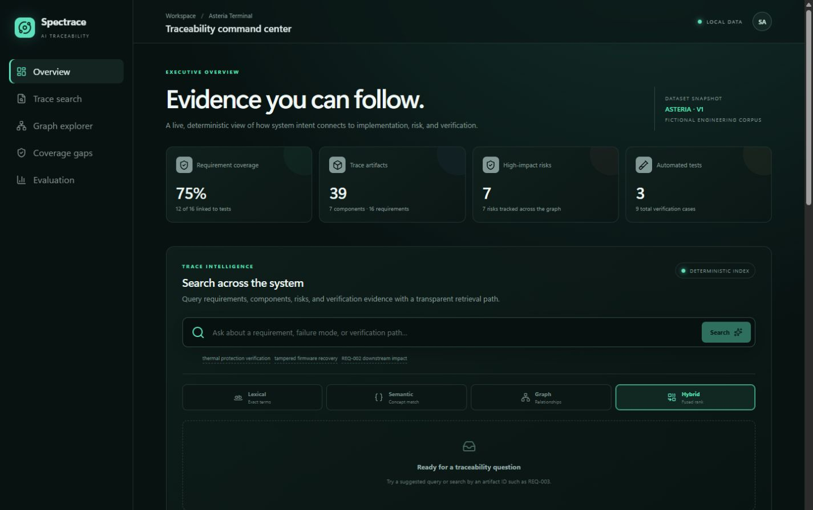
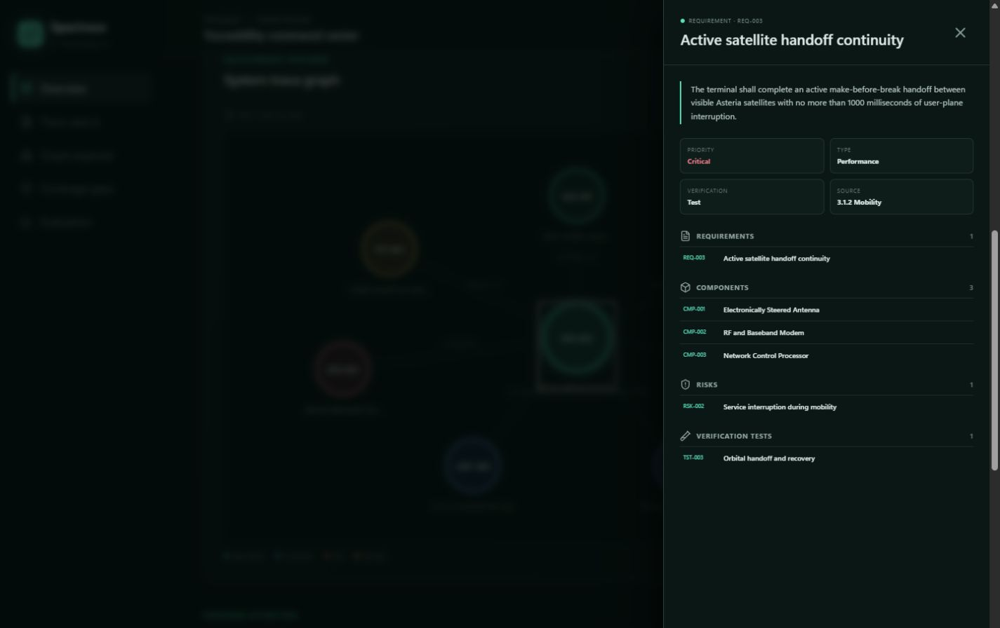
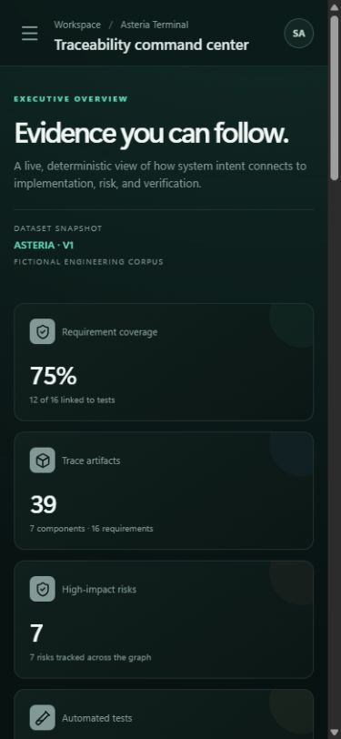

# Spectrace AI

Spectrace AI is an interactive requirements traceability workspace for a fictional Asteria
low-Earth-orbit satellite user terminal. Milestone 4 adds a portfolio-quality React and TypeScript
dashboard to the existing FastAPI and Neo4j backend: executive coverage metrics, unified
multi-mode retrieval, explainable scoring, an interactive relationship graph, artifact details,
evidence-gap views, and a checked-in retrieval evaluation. The source data, relationships,
embeddings, judgments, and UI are deterministic and require no hosted model or secret.

## Product tour





The responsive layout retains the full metric and exploration flow on narrow screens:



## Architecture

```text
┌──────────────────────┐     typed HTTP      ┌──────────────────────┐
│ React + TypeScript   │────────────────────▶│ FastAPI route layer  │
│ Vite dashboard       │                     └──────────┬───────────┘
└──────────────────────┘                                │
                                            ┌───────────▼──────────┐
                                            │ Traceability service │
                                            │ Retrieval + WRRF     │
                                            └───────────┬──────────┘
                                                        │ typed protocols
                                         ┌──────────────┴──────────────┐
                                ┌────────▼─────────┐          ┌────────▼─────────┐
                                │ Validated JSON   │          │ Neo4j repository │
                                │ reference source │          │ search + graph   │
                                └──────────────────┘          └──────────────────┘
```

The application creates its selected repository lazily, reuses it for the app lifetime, and closes
the Neo4j driver during FastAPI shutdown. No driver is created globally at import time. Repository
failures are translated into domain-specific, structured API responses rather than exposing driver
details.

```text
app/
├── api/             # Existing routes plus graph and retrieval routes
├── core/            # Settings, backend selection, dependency injection, lifecycle
├── models/          # Strict domain, graph, and retrieval request/response models
├── repositories/    # JSON/Neo4j adapters, protocols, domain exceptions
├── retrieval/       # Local encoder, IR metrics, strategy comparison, failure analysis
├── services/        # Traceability, graph, and deterministic rank fusion
└── main.py          # Application factory and ASGI app
frontend/             # Vite, React, typed API client, components, and UI tests
data/                # Domain data and judged synthetic retrieval queries
scripts/             # Idempotent seeding and retrieval evaluation commands
tests/               # Unit, contract, API, and isolated Neo4j tests
```

The frontend does not maintain a shadow data model. Its executive metrics, gap calculations,
graph nodes, and artifact relationships are derived from the existing typed API responses. Search
always calls the backend retrieval contract; when Neo4j is unavailable the UI reports that state
instead of substituting fabricated results. A single new read-only endpoint,
`GET /retrieval/evaluation`, exposes the checked-in benchmark snapshot.

## Run the complete product

With Docker and Docker Compose installed, build the dashboard, start Neo4j and FastAPI, seed the
deterministic graph, and serve the built UI with one command:

```bash
docker compose up --build
```

Open [http://127.0.0.1:8000/dashboard/](http://127.0.0.1:8000/dashboard/). The Compose stack uses
the development-only password `spectrace-local-password` unless `NEO4J_PASSWORD` is supplied.
The named Neo4j volume persists local data; seeding is additive and idempotent.

For hot-reload development after completing the Python setup below and running
`corepack enable && pnpm --dir frontend install`:

```bash
python -m scripts.dev
```

This starts FastAPI at port 8000 and Vite at
[http://127.0.0.1:5173/dashboard/](http://127.0.0.1:5173/dashboard/). The default JSON backend
supports dashboard exploration but intentionally returns a clear unavailable state for native
Neo4j retrieval. Use the environment configuration below for all four search modes.

## Graph schema

```text
(TestCase)-[:VERIFIES]->(Requirement)-[:APPLIES_TO]->(Component)
                                  │
                                  ├─[:DEPENDS_ON]─▶(Requirement)
                                  │
                                  └─[:ADDRESSES]──▶(Risk)
```

Every domain node also has the common `TraceEntity` label. Neo4j stores a generated `search_text`
property and a 256-dimensional normalized `embedding`; relationship ID arrays are reconstructed
from graph edges and are never duplicated as node properties. Public domain responses strip both
internal retrieval properties, preserving earlier JSON/Neo4j response parity.

| Label | Unique ID | Count |
|---|---:|---:|
| `Requirement` | `REQ-nnn` | 16 |
| `Component` | `CMP-nnn` | 7 |
| `Risk` | `RSK-nnn` | 7 |
| `TestCase` | `TST-nnn` | 9 |

| Relationship | Direction | Count |
|---|---|---:|
| `DEPENDS_ON` | Requirement → Requirement | 13 |
| `APPLIES_TO` | Requirement → Component | 39 |
| `ADDRESSES` | Requirement → Risk | 18 |
| `VERIFIES` | TestCase → Requirement | 12 |

Uniqueness constraints protect every domain ID. Secondary indexes cover requirement priority/type,
component name, risk severity, and test-case status. `trace_entity_fulltext` is a Lucene full-text
index and `trace_entity_embedding` is a cosine vector index over the common label.

## Retrieval design

`POST /retrieval/search` is available with the Neo4j backend. It retrieves bounded candidate pools
from three independent channels:

- lexical relevance from Neo4j full-text search with sanitized query tokens;
- semantic similarity from Neo4j vector search using a deterministic local concept/token/character
  feature encoder;
- graph proximity from one-to-three-hop undirected expansion around exact-ID and top search seeds.

Hybrid mode applies weighted reciprocal-rank fusion with `k=10`: lexical `0.45`, semantic `0.45`,
and graph `0.10`. Results are ordered by fused score and then entity ID. Each result exposes raw
score, within-channel normalized score, rank, contribution, graph distance, and graph anchors.
Entity types, relationship types, graph depth, query length, candidate pools, and returned results
are enum- or range-bounded; relationship names are never interpolated into Cypher.

## Backends

`SPECTRACE_REPOSITORY_BACKEND=json` is the safe default. It loads and validates the JSON dataset as
one referentially sound snapshot. All Milestone 1 endpoints work without external infrastructure.
Graph and retrieval endpoints return a structured `503` with code `neo4j_backend_required`, because
Neo4j-native index and traversal behavior is not silently simulated in memory.

`SPECTRACE_REPOSITORY_BACKEND=neo4j` makes graph relationships authoritative while preserving the
same domain models, ordering, coverage calculations, and existing API responses. Invalid backend
values fail settings validation immediately. A Neo4j password is mandatory for this mode.

## Setup

Python 3.11 or newer and, for graph development, Docker with Compose are required.

```bash
python -m venv .venv
source .venv/bin/activate        # Windows PowerShell: .venv\Scripts\Activate.ps1
python -m pip install --upgrade pip
pip install -e ".[dev]"
cp .env.example .env            # Windows PowerShell: Copy-Item .env.example .env
```

Set a local password in the ignored `.env` file. Never commit that file.

```dotenv
SPECTRACE_REPOSITORY_BACKEND=neo4j
NEO4J_URI=bolt://localhost:7687
NEO4J_USERNAME=neo4j
NEO4J_PASSWORD=choose-a-local-password
NEO4J_DATABASE=neo4j
```

Start Neo4j 5.26 LTS Community Edition and confirm the container is healthy:

```bash
docker compose up -d
docker compose ps
```

Neo4j Browser is available at [http://localhost:7474](http://localhost:7474). Bolt clients connect
to `bolt://localhost:7687`.

## Seed the graph

The seeder validates `data/asteria_dataset.json`, creates scalar/full-text/vector indexes with
`IF NOT EXISTS`, generates deterministic embeddings, uses `MERGE` for every node and edge, waits
for indexes to become online, and prints authoritative counts.

```bash
python -m scripts.seed_graph
python -m scripts.seed_graph        # same counts; no duplicates
```

Seeding is additive and never deletes graph data by default. For a disposable development database,
deletion must be explicitly authorized:

```bash
python -m scripts.seed_graph --reset
```

`--reset` executes `MATCH (node) DETACH DELETE node` against the configured database before
re-seeding. Do not use it against a database containing data you intend to retain.

Start the API after seeding:

```bash
uvicorn app.main:app --reload
```

OpenAPI documentation is at [http://127.0.0.1:8000/docs](http://127.0.0.1:8000/docs).

## API

Milestone 1 contracts remain unchanged:

| Method | Path | Purpose |
|---|---|---|
| GET | `/health` | Application liveness |
| GET | `/requirements` | Requirements |
| GET | `/requirements/{requirement_id}` | One requirement |
| GET | `/components` | Components |
| GET | `/risks` | Risks |
| GET | `/test-cases` | Existing test cases |
| GET | `/traceability/summary` | Coverage and distributions |
| GET | `/traceability/uncovered` | Requirements without test links |
| GET | `/traceability/requirements/{requirement_id}` | Resolved deterministic traceability |

Neo4j-only graph endpoints:

| Method | Path | Purpose |
|---|---|---|
| GET | `/graph/health` | Neo4j connectivity/database check |
| GET | `/graph/requirements/{id}/dependencies?depth=5` | Transitive prerequisites |
| GET | `/graph/requirements/{id}/impact?depth=5` | Downstream dependents |
| GET | `/graph/requirements/{id}/components` | Connected components |
| GET | `/graph/path?source_id=...&target_id=...` | Deterministic shortest traceability path |
| GET | `/graph/cycles` | Dependency cycles |
| GET | `/graph/risks/unverified` | Risks without a TestCase→Requirement→Risk path |
| GET | `/graph/orphans` | Nodes with no relationships |

Neo4j-native retrieval:

| Method | Path | Purpose |
|---|---|---|
| POST | `/retrieval/search` | Lexical, semantic, graph, or explainable hybrid retrieval |
| GET | `/retrieval/evaluation` | Checked-in synthetic benchmark summary |

Examples:

```bash
curl "http://127.0.0.1:8000/graph/requirements/REQ-011/dependencies?depth=2"
curl "http://127.0.0.1:8000/graph/requirements/REQ-001/impact?depth=3"
curl "http://127.0.0.1:8000/graph/path?source_id=TST-003&target_id=RSK-002"
curl http://127.0.0.1:8000/graph/risks/unverified
```

```bash
curl -X POST http://127.0.0.1:8000/retrieval/search \
  -H "Content-Type: application/json" \
  -d '{
    "query": "tampered firmware image recovery",
    "mode": "hybrid",
    "entity_types": ["Requirement", "TestCase", "Risk"],
    "relationships": ["DEPENDS_ON", "ADDRESSES", "VERIFIES"],
    "graph_depth": 2,
    "result_count": 5
  }'
```

Traversal depth is restricted to 1–10. Cypher queries use a static maximum of 10 hops and a
parameterized requested-depth filter, avoiding query-string construction from user input. Shortest
path ties are ordered by their node-ID sequence for deterministic output.

## Example Cypher

These read-only queries are useful in Neo4j Browser:

```cypher
MATCH (requirement:Requirement)-[edge]->(target)
RETURN requirement.id, type(edge), target.id
ORDER BY requirement.id, type(edge), target.id;
```

```cypher
MATCH path = (source:Requirement {id: 'REQ-011'})-[:DEPENDS_ON*1..10]->(dependency)
WHERE length(path) <= 2
RETURN DISTINCT dependency.id
ORDER BY dependency.id;
```

```cypher
MATCH (risk:Risk)
WHERE NOT EXISTS {
  MATCH (:TestCase)-[:VERIFIES]->(:Requirement)-[:ADDRESSES]->(risk)
}
RETURN risk.id, risk.title
ORDER BY risk.id;
```

Application code supplies all dynamic values as parameters and explicitly sets `database_` for every
driver query.

## Testing

Run deterministic unit/API/contract tests and the coverage gate without Neo4j:

```bash
ruff check .
ruff format --check .
pytest -m "not integration" --cov=app --cov-report=term-missing --cov-fail-under=90
git diff --check
```

Run the frontend quality gates:

```bash
pnpm --dir frontend check
pnpm --dir frontend test
pnpm --dir frontend build
```

Neo4j integration tests intentionally reset their target. They refuse to run unless both opt-in and
isolation confirmation are present. Use only a disposable database/container:

```bash
SPECTRACE_RUN_NEO4J_TESTS=1 \
SPECTRACE_NEO4J_TEST_ISOLATED=1 \
SPECTRACE_NEO4J_TEST_URI=bolt://localhost:7687 \
SPECTRACE_NEO4J_TEST_USERNAME=neo4j \
SPECTRACE_NEO4J_TEST_PASSWORD=your-test-password \
SPECTRACE_NEO4J_TEST_DATABASE=neo4j \
pytest -m integration
```

GitHub Actions builds and typechecks the dashboard, runs its interaction tests, starts a fresh
Neo4j 5.26 Community service, runs Ruff, enforces the 90% application coverage gate, and then runs
the isolated integration suite. The suite proves idempotent counts,
repository contract parity, all traceability response parity, bounded traversal, impact, shortest
paths, cycles, unverified risks, orphan detection, native full-text/vector search, bounded retrieval
filters, deterministic fusion, and API parity. CI then reseeds and prints the evaluation report;
integration tests are run explicitly and are not counted as passing when skipped.

## Retrieval evaluation

`data/retrieval_evaluation.json` contains eight synthetic queries and graded relevant-result
judgments. The standard metrics implementation treats relevance greater than zero as a binary hit
for Precision@K, Recall@K, and MRR, and uses graded gains for nDCG@K. Run the production indexes:

```bash
python -m scripts.seed_graph --reset   # disposable database only
python -m scripts.evaluate_retrieval --no-latency --json-out /tmp/retrieval_report.json
```

The command runs one dataset against every requested strategy, scores the existing metrics,
compares hybrid with its component strategies, and classifies failures. JSON goes to stdout (or
`--json-out`) and the human-readable summary goes to stderr, so the JSON stream stays pipeable.

| Flag | Purpose |
|---|---|
| `--dataset` | judged dataset to run (default `data/retrieval_evaluation.json`) |
| `--strategies` | subset of `lexical semantic graph hybrid` to compare |
| `--depth` | ranks inspected per query; metrics are still scored at the dataset `k` |
| `--primary-metric` | metric used for hybrid-vs-component comparison (default `ndcg_at_k`) |
| `--highlight-limit` | number of improvements and regressions to highlight |
| `--no-latency` | omit measured timings so the JSON is byte-for-byte reproducible |
| `--json-out` | write the JSON report to a file |

### Dataset format

```json
{
  "name": "asteria-hybrid-retrieval-v1",
  "k": 5,
  "cases": [
    {
      "name": "thermal protection verification",
      "request": { "query": "temperature protection shutdown verification", "limit": 5 },
      "relevance": { "REQ-005": 3, "REQ-006": 3, "TST-004": 3, "RSK-003": 2 }
    }
  ]
}
```

`request` accepts the same fields as the retrieval API (`query`, `limit`, `entity_types`,
`seed_ids`, `graph_depth`); `mode` is supplied by the harness. Grades are graded gains, and any
grade greater than zero counts as relevant for Precision@K, Recall@K, and MRR.

### Strategies and metrics

Only the modes the service actually implements are evaluated: `lexical`, `semantic` (the
vector-only strategy backed by the local encoder and the Neo4j vector index), `graph`, and `hybrid`
(weighted reciprocal-rank fusion of the three). Each strategy reports Precision@K, Recall@K, MRR,
nDCG@K, and mean latency, plus a per-query row with the query, relevant IDs, the ranked retrieved
artifacts with scores and grades, missing IDs, relevant IDs pushed below the cutoff, and the
per-query metric values.

Measured on the checked-in dataset with Neo4j Community 5.26.0 at `K=5`:

| Mode | Precision@5 | Recall@5 | MRR | nDCG@5 |
|---|---:|---:|---:|---:|
| Lexical | 0.6000 | 0.7625 | 0.8750 | 0.8232 |
| Semantic | 0.6250 | 0.7670 | 1.0000 | 0.8524 |
| Graph | 0.2250 | 0.2286 | 0.5000 | 0.1530 |
| Hybrid | 0.6500 | 0.7982 | 0.9375 | 0.8424 |

These are observed synthetic-benchmark results, not production relevance claims. Hybrid improves
Precision@5 and Recall@5; semantic-only is strongest for first-result rank and graded ordering on
this small corpus.

### Failure analysis

Failure categories are derived only from measured rankings and graded judgments; no LLM is
involved. Per-query categories are `no_results`, `missing_relevant` (a judged artifact never
appeared in the inspected ranks), `ranked_below_cutoff` (it was retrieved but ranked outside the
top `k`), and `top_result_not_relevant`. Cross-strategy categories compare hybrid against the best
component strategy on the primary metric: `hybrid_improved`, `hybrid_regressed`, `graph_helped` and
`vector_helped` (the strategy uniquely supplied a relevant artifact that hybrid kept in its top `k`)
and `graph_hurt` (hybrid promoted a graph-only non-relevant artifact into its top `k` on a query
where it also scored below the best component).

Example summary for the checked-in dataset:

```text
strategy        P@K      R@K      MRR   nDCG@K   latency_ms
lexical      0.6000   0.7625   0.8750   0.8232            -
semantic     0.6250   0.7670   1.0000   0.8524            -
graph        0.2250   0.2286   0.5000   0.1530            -
hybrid       0.6500   0.7982   0.9375   0.8424            -

Failure categories (primary metric ndcg_at_k):
  graph_hurt              2
  hybrid_improved         1
  hybrid_regressed        3
  missing_relevant        16
  ranked_below_cutoff     7
  top_result_not_relevant 3
  vector_helped           1

Top hybrid improvements:
  +0.0081 emergency congestion priority (hybrid 1.0000 vs lexical 0.9919)

Top hybrid regressions:
  -0.1596 authentication downstream impact (hybrid 0.2921 vs graph 0.4517)
  -0.1143 input power interruption (hybrid 0.8452 vs lexical 0.9595)
  -0.0494 thermal protection verification (hybrid 0.9506 vs lexical 1.0000)
```

Read a regression as "fusion diluted a strategy that was already correct for this query": the
per-query rows in the JSON report show which relevant IDs moved below the cutoff and which
non-relevant IDs replaced them.

## Troubleshooting

- `NEO4J_PASSWORD is required`: set a non-empty password in the ignored `.env` file.
- `repository_unavailable`: confirm `docker compose ps` reports healthy and verify URI/credentials.
- `neo4j_backend_required`: select `SPECTRACE_REPOSITORY_BACKEND=neo4j` and seed the graph.
- Empty Neo4j results: run `python -m scripts.seed_graph`, then compare the printed counts above.
- Authentication failure after changing `.env`: the persistent volume retains the original password;
  use the original password or intentionally recreate the development volume.
- Integration tests refuse to start: provide both isolation flags and all `SPECTRACE_NEO4J_TEST_*`
  variables for a disposable database.

## Milestone 4 limitations

- Neo4j Community supports the configured single database; production tenancy/cluster concerns are
  not addressed.
- Traversals are deliberately bounded at 10 hops and dependency cycle searches report cycles only
  within that bound.
- Non-reset seeding is idempotent and additive. It does not remove relationships that were deleted
  from a later source dataset.
- Coverage still means a test-case trace link, not execution evidence, pass/fail state, or test
  quality.
- There are no write APIs, pagination, authentication/authorization, migrations, metrics, or tracing.
- The Asteria dataset is synthetic and not suitable for flight qualification.
- The local semantic encoder is deliberately compact and domain-normalized. It has no pretrained
  language understanding and should be replaced behind the encoder interface for a broader corpus.
- Graph-only retrieval is weak for free-text queries in the synthetic benchmark; it is most useful
  with explicit entity IDs or as bounded evidence in fusion.
- WRRF weights and `k` were selected for this small checked-in corpus and require validation before
  use on materially different data.
- Failure categories are rule-based summaries of measured rankings, not causal explanations, and
  they compare hybrid against single strategies on one primary metric at a time.
- Measured latency depends on the local machine and warm caches. Use `--no-latency` whenever the
  JSON report must be compared byte-for-byte.
- There is no LLM, LangGraph orchestration, GraphRAG generation, or AI-authored engineering claim.
- The relationship explorer presents a focused neighborhood around one requirement rather than a
  general-purpose graph authoring surface.
- Unverified-risk status in the JSON-backed UI is derived from the same requirement and test links;
  the native `/graph/risks/unverified` endpoint remains Neo4j-only.
- The frontend has no write workflows, saved searches, pagination, authentication, or multi-user
  collaboration. The local Compose password is for development only.

## Roadmap

The next milestone can add versioned graph migrations, evidence ingestion, stronger pluggable local
or hosted embeddings, and LangGraph orchestration with human review. Probabilistic components should
remain downstream of the validated repository contracts and retain deterministic evaluation fixtures
for every generated recommendation.
